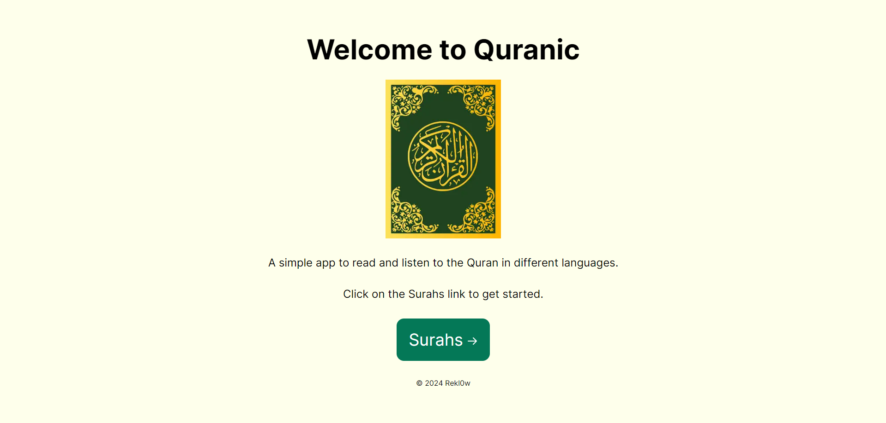
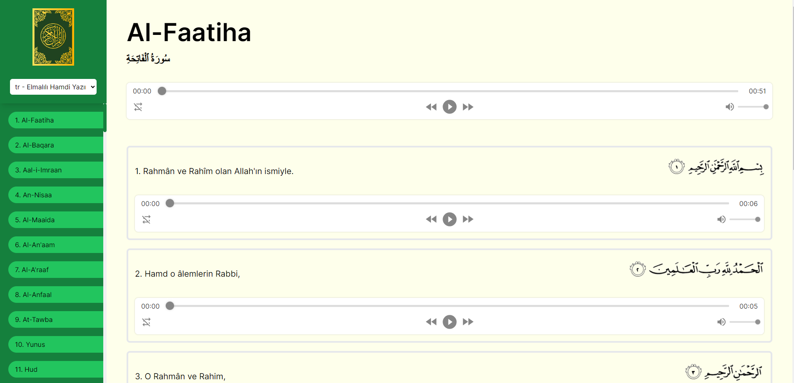

# Quranic

Quranic is a user-friendly application designed to explore and learn the Quran. This application provides functionality for reading, understanding meanings, listening and exploring various translations of the ayahs and surahs. It serves Muslims and anyone interested in learning more about the Quran.



## Features

- Read the Quran
- View meanings of ayahs and surahs in different languages
- Quickly find surahs and ayahs
- Explore different translations of the Quran
- Listen to recitations of surahs and ayahs

## Tech Stack

- **React.js:** A JavaScript library for building user interfaces.
- **Next.js:** A React framework for server-side rendering, static site generation, and more.
- **Axios:** A promise-based HTTP client for making requests to the backend.
- **Tailwind CSS:** A utility-first CSS framework for creating custom designs quickly and efficiently.

## Deployment

### Quick Access

Quranic is deployed on Vercel. You can access the deployed version [here](https://quran-gules-six.vercel.app).

### Local Installation

1. **Clone the Repository:**

   ```bash
   git clone https://github.com/Rekl0w/Quran.git
   ```

2. **Navigate to the Project Directory:**

   ```bash
   cd Quran
   ```

3. **Install Dependencies:**

   ```bash
   npm install
   ```

4. **Run the Application:**

   ```bash
   npm start
   ```

5. **Access the Application:**
   Open your web browser and go to `http://localhost:3000` to view the Quranic application.

## Screenshots




## License

This project is licensed under the MIT License - see the [LICENSE](LICENSE) file for details.
